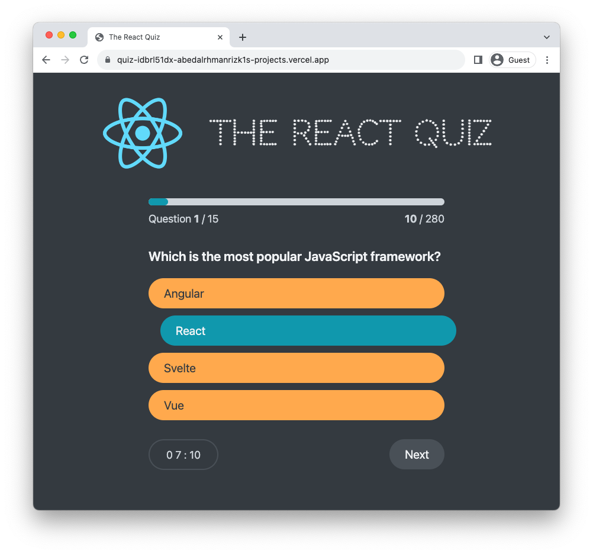

# The React Quiz

**The React Quiz** is React-based Quiz Application that allows users to answer a series of questions within a time limit. The app consists of various components and features to provide a smooth user experience

## Demo

[The React Quiz](https://quiz-app-one-inky.vercel.app/)

## Screenshots

## Features

- The application starts in the "loading" state, fetching questions from an API. If there's an error, it displays an error message.
- Once questions are loaded, the user can click "Start" to begin the quiz.
- Users answer each question by selecting an answer option.
- The progress bar and score are updated as the user progresses through the quiz.
- After answering all questions, the FinishScreen displays the user's score and high score, and the option to restart the quiz.

## Technologies Used

- React
- React Hooks: useReducer and useEffect, for state management and handling side effects.
- JSON Server
